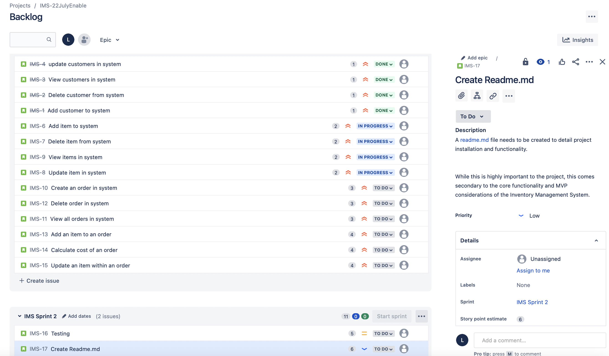
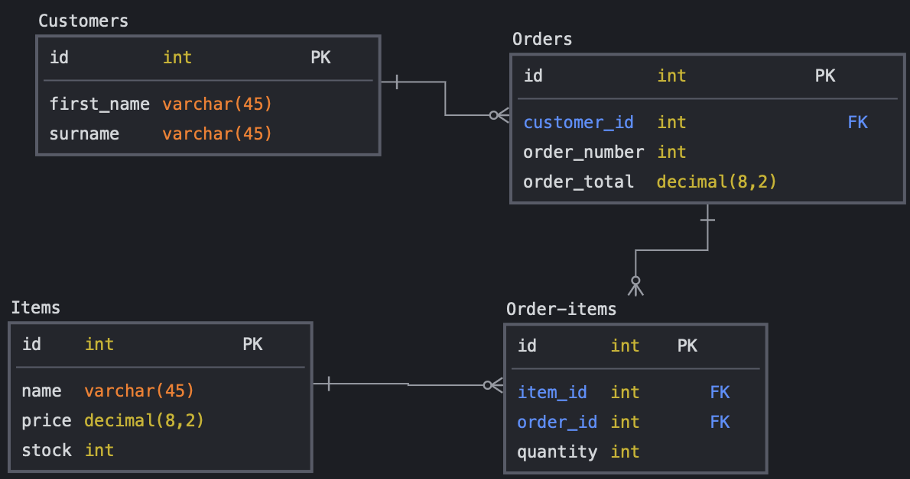

Coverage: 34%
# CLI Inventory Management System

 The CLI Inventory Management System (IMS) is used as a friendly interface for personal and enterpise applications in managing customers, their orders and the logistics of those orders. The functionality of the system allows users to create, read, update, and delete (CRUD) customers, orders and associated items. 

## Getting Started

These instructions will get you a copy of the project up and running on your local machine for development and testing purposes. See deployment for notes on how to deploy the project on a live system.

## Project Planning and Management

### Jira

Jira was used for project planning and time management. The Jira site can be accessed [here](https://leogornovskiy.atlassian.net/jira/software/projects/IMS/boards/3) and a sample is shown 

The project was completed in one sprint with user stories describing the functionality of individual issues in the backlog.

### Database Schema

The schema for the database can be readily demonstrated with an ERD diagram. This diagram served as the basis for the development of the database for the application. 


## Prerequisites


#### Visual Studio Code
Visual Studio (VS) Code is a Microsoft source-code editing app and was used in the creation and editing of this project. It can be downloaded at the official [Microsoft site](https://code.visualstudio.com/download).

#### MySQL Workbench
MySQL Workbench is a database design tool for relational databases and can be downloaded from the MySQL [website](https://dev.mysql.com/downloads/workbench/)

#### Java
Java Development Kit 18 is required for the use and development of this program. The required Java version can be obtained from the official [Oracle site](https://www.oracle.com/java/technologies/javase/jdk18-archive-downloads.html)
#### Maven
Maven is a build automation tool that is frequently used to run tests on Java applications and can be downloaded from the official [site](https://maven.apache.org/download.cgi).


#### GitHub
A GitHub account is required for the use of Git and GitBash. For more information visit the official [site](https://github.com/)

#### Git

Git is a distributed version control system, which is used to keep track of changes to the project. 

#### GitBash

GitBash is the associated CLI tool and can be downloaded from the official [website](https://git-scm.com/downloads.
To ensure that the app is properly linked to your GitHub account enter your credentials in the terminal as follows:

```
git config --global user.name "username"
```

```
git config --global user.email "email@email.com"
```

### Installing

This is a brief guide to ensure the application works as intended. 

- Java Development Kit 18 needs to be downloaded and installed. 
- Ensure that environment variables are correctly setup with %JAVA_HOME%/bin appended to path.
- Download and install Visual Studio Code.
- Add Maven to the IDE and add %MAVEN_HOME%/bin to path.
- Setup MySQL Workbench.
- Download GitBash and create a GitHub account if you do not already have one.

Once all prerequisite apps are installed, the repo can be cloned using GitBash or Terminal (Mac). Then the db.properties file needs to be updated to ensure it connects to your MySQL Workbench server.

### Using the Inventory Management System
The IMS gives the user the ability to manipulate Customers, Orders and Items, which have unique attributes and relationships as per the database schema shown earlier.

The attributes for each of the entities are as follows:

#### Customers
- First Name
- Surname
- Customer ID

#### Orders
- Customer ID
- Order Number
- Order Total

#### Items
- Item ID
- Name 
- Price 
- Stock

These attributes can be viewed and amended with the Create, Read, Update and Delete (CRUD )functionality of the IMS. 

As CRUD fucntionality is similar between the entities, it is demonstrated for Customer here. The other entities will have differing attributes based on the above lists, but are otherwise identical in editing or viewing. 

*Customer* 

- Create - Prompts the user to enter name, then surname and adds the new customer to the database. 
- Read - Displays all customers in the database
- Update - Prompts user to enter customer ID then asks for new name and surname to be updated in the database. 
- Delete  - Prompts user to enter a customer ID and then deletes the customer from the database. 


## Running the tests

Explain how to run the automated tests for this system. Break down into which tests and what they do

### Unit Tests 

Explain what these tests test, why and how to run them

```
Give an example
```

### Integration Tests 
Explain what these tests test, why and how to run them

```
Give an example
```

### And coding style tests

Explain what these tests test and why

```
Give an example
```

## Deployment

Add additional notes about how to deploy this on a live system

## Built With

* [Maven](https://maven.apache.org/) - Dependency Management

## Versioning

We use [GitHub](http://github.com/) for versioning.

## Authors

* **Chris Perrins** - *Initial work* - [christophperrins](https://github.com/christophperrins)
* **Leo Gornovskiy** - *All further work* - [lng96](https://github.com/lng1996)

## License

This project is licensed under the MIT license - see the [LICENSE.md](LICENSE.md) file for details 

*For help in [Choosing a license](https://choosealicense.com/)*

## Acknowledgments

* QA Academy and Trainers (Jordan Benbelaid, Anoush Lowton, Christopher Yiangou)
# IMS-Start
# IMS-Start
